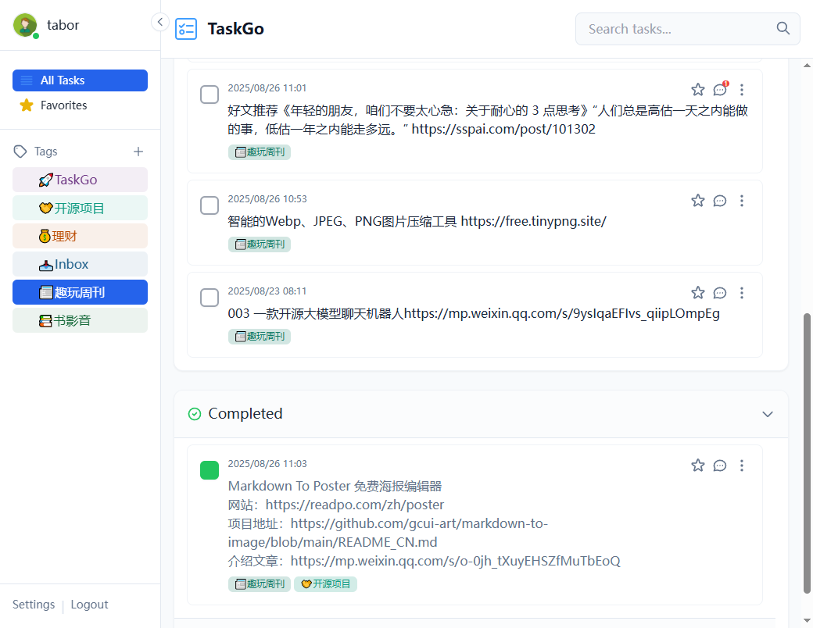

# TaskGo 任务管理系统

[中文](./README-zh.md) | [English](./README.md)

TaskGo 是一个使用 Go 语言和 Gin 框架构建的现代化、轻量级的任务管理系统。它采用 SQLite 数据库，无需复杂配置，并提供了一个简洁、用户友好的响应式 Web 界面。项目支持 PWA 特性，可以方便地“安装”到桌面或手机主屏幕，像原生应用一样使用。



## ✨ 主要功能

- **用户认证:** 支持用户注册和登录，确保任务数据私密性。
- **任务管理:** 提供完整的 CRUD (创建、读取、更新、删除) 功能。
- **智能标签:** 在输入框中通过 `#标签` 格式（例如：`#工作 #紧急 完成项目报告`）为任务添加一个或多个标签。
- **标签筛选:** 左侧边栏会自动汇总所有标签，点击即可快速筛选相关任务。
- **状态切换:** 通过复选框轻松切换任务的"待办"与"已完成"状态。
- **动态搜索:** 右上角提供实时搜索功能，可根据关键词快速过滤所有任务。
- **折叠侧边栏:** 左侧标签栏可以通过单击顶部区域折叠和展开，在宽屏上提供更大的内容区域，并自动记忆状态。
- **响应式与 PWA:**
  - 界面自适应桌面、平板和手机等不同尺寸的屏幕。
  - 在移动端，标签栏会自动收起，通过"Tags"按钮唤出。
  - 支持添加到主屏幕，提供离线访问能力。
- **标签选择优化:** 输入`#`后直接显示匹配标签列表，无需额外提示文本。
- **移动端输入优化:** 在移动浏览器中，Enter键默认用于换行，提供更自然的输入体验。

## 🛠️ 技术栈

- **后端:**
  - **Go 1.24+**
  - **Gin:** 高性能的 Go Web 框架。
  - **GORM:** Go ORM 库，用于操作数据库。
  - **golang-jwt:** 用于生成和验证 JWT (JSON Web Tokens)。
- **前端:**
  - **HTML5 / CSS3**
  - **Vanilla JavaScript (ES6+):** 无前端框架，轻量且高效。
- **数据库:**
  - **SQLite:** 一个轻量级的、无服务器的嵌入式数据库。
- **容器化:**
  - **Docker & Docker Compose:** 用于快速构建、打包和部署应用。

## 🚀 本地运行

在开始之前，请确保您的本地环境已经安装了以下工具：

- [Go](https://golang.org/dl/) (版本 1.24或更高)
- [Docker](https://www.docker.com/get-started) 和 [Docker Compose](https://docs.docker.com/compose/install/)

---

### 方法一：直接在本地运行

1.  **克隆项目 (如果您在本地)**

    ```bash
    git clone https://github.com/tabortao/TaskGo.git
    cd TaskGo
    ```

2.  **安装依赖**
    打开终端，运行以下命令以下载 Go 模块：

    ```bash
    go mod tidy
    ```

3.  **运行应用**

    ```bash
    go build -o taskgo.exe ./cmd/main.go # 构建项目
    .\taskgo.exe # 启动项目
    go run ./cmd/main.go # 直接启动项目
    ```

    应用启动后，`taskgo.db` 数据库文件将在项目根目录自动创建。

4.  **访问应用**
    在浏览器中打开 `http://localhost:8080`。

---

### 方法二：使用 Docker 运行 (推荐)

这是最简单的启动方式，可以避免本地环境差异带来的问题。

1.  **构建并启动容器**
    在项目根目录下，运行以下命令：

    ```bash
    docker-compose up --build
    ```

    Docker 将会自动构建镜像并启动服务。本地的 `taskgo.db` 文件（如果存在）和 `static` 文件夹都会被打包进镜像中。

2.  **访问应用**
    在浏览器中打开 `http://localhost:8080`。

## 📖 如何使用

1.  **注册/登录:** 首次使用请先注册一个账户，然后登录。
2.  **创建任务:** 在顶部的输入框中输入任务内容。您可以随时加入 `#标签名` 来为任务分类。
3.  **管理任务:**
    - 点击任务前的复选框来完成任务。
    - 点击任务文字本身可以进行编辑。
    - 点击任务最右侧的删除按钮可以删除它。
4.  **筛选和搜索:**
    - 点击左侧边栏的标签可以只显示该标签下的任务。
    - 使用右上角的搜索框可以按关键词搜索所有任务。

## 📁 项目结构

```bash
/TaskGo
|-- cmd/main.go                # 程序主入口
|-- docs/                      # 项目文档
|-- internal/                  # 项目内部代码，不对外暴露
|   |-- auth/                  # JWT 认证逻辑
|   |-- database/              # 数据库连接与初始化
|   |-- handlers/              # HTTP 请求处理器 (API 逻辑)
|   |-- middleware/            # Gin 中间件
|   |-- models/                # 数据模型 (structs)
|   `-- router/                # Gin 路由配置
|-- web/                       # 所有前端文件
|   |-- static/                # CSS, JavaScript, 图标等静态资源
|   |-- templates/             # HTML 模板
|   |-- manifest.json          # PWA 清单文件
|   `-- service-worker.js      # PWA Service Worker
|-- go.mod                     # Go 模块依赖
|-- go.sum
|-- Dockerfile                 # 用于构建生产环境的 Docker 镜像
|-- docker-compose.yml         # 用于本地开发的 Docker Compose 配置
`-- README.md                  # 本文档
```
