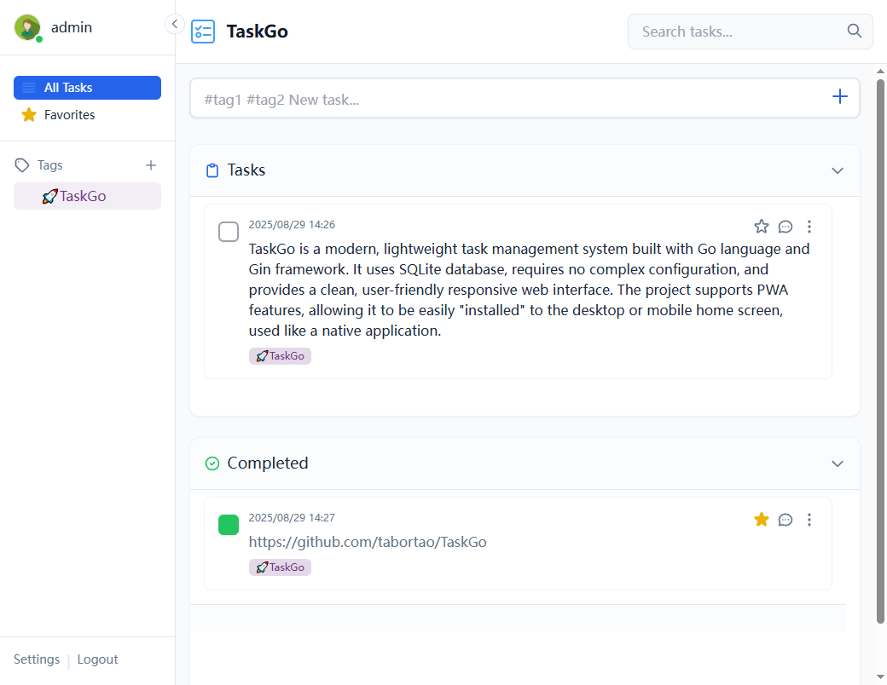

# TaskGo Task Management System

[中文](./README-zh.md) | [English](./README.md)

TaskGo is a modern, lightweight task management system built with Go language and Gin framework. It uses SQLite database, requires no complex configuration, and provides a clean, user-friendly responsive web interface. The project supports PWA features, allowing it to be easily "installed" to the desktop or mobile home screen, used like a native application.



## ✨ Main Features

- **User Authentication:** Supports user registration and login to ensure task data privacy.
- **Task Management:** Provides complete CRUD (Create, Read, Update, Delete) functionality.
- **Smart Tags:** Add one or more tags to tasks by using the `#tag` format in the input box (e.g., `#work #urgent Complete project report`).
- **Tag Filtering:** The left sidebar automatically aggregates all tags, allowing quick filtering of related tasks by clicking.
- **Status Toggle:** Easily switch between "To-Do" and "Completed" task statuses via checkboxes.
- **Dynamic Search:** The top right corner provides real-time search functionality to quickly filter all tasks by keywords.
- **Collapsible Sidebar:** The left tag sidebar can be collapsed and expanded by clicking the top area, providing a larger content area on wide screens and automatically remembering its state.
- **Paginated Loading:** The "Completed" list defaults to showing only the latest 10 records; click "Show More" to load older records, improving performance.
- **Responsive & PWA:**
  - The interface adapts to different screen sizes such as desktops, tablets, and mobile phones.
  - On mobile devices, the tag sidebar automatically collapses and can be invoked via the "Tags" button.
  - Supports adding to the home screen, providing offline access.
- **Optimized Tag Selection:** After typing `#`, a list of matching tags is directly displayed, without additional prompt text.
- **Mobile Input Optimization:** In mobile browsers, the Enter key defaults to line breaks, providing a more natural input experience.

## 🛠️ Technology Stack

- **Backend:**
  - **Go 1.24+**
  - **Gin:** High-performance Go web framework.
  - **GORM:** Go ORM library for database operations.
  - **golang-jwt:** Used for generating and verifying JWT (JSON Web Tokens).
- **Frontend:**
  - **HTML5 / CSS3**
  - **Vanilla JavaScript (ES6+):** No frontend framework, lightweight and efficient.
- **Database:**
  - **SQLite:** A lightweight, serverless, embedded database.
- **Containerization:**
  - **Docker & Docker Compose:** Used for rapid building, packaging, and deployment of applications.

## 🚀 Local Run

Before starting, please ensure your local environment has the following tools installed:

- [Go](https://golang.org/dl/) (version 1.24.1 or higher)
- [Docker](https://www.docker.com/get-started) and [Docker Compose](https://docs.docker.com/compose/install/)

---

### Method One: Run Directly Locally

1.  **Clone the project (if you are local)**

    ```bash
    git clone https://github.com/tabortao/TaskGo.git
    cd TaskGo
    ```

2.  **Install Dependencies**
    Open a terminal and run the following command to download Go modules:

    ```bash
    go mod tidy
    ```

3.  **Run the Application**

    ```bash
    go build -o taskgo.exe ./cmd/main.go # Build project
    .\taskgo.exe # Start project
    go run ./cmd/main.go # Directly start project
    ```

    After the application starts, the `taskgo.db` database file will be automatically created in the project root directory.

4.  **Access the Application**
    Open `http://localhost:8080` in your browser.

---

### Method Two: Run with Docker (Recommended)

This is the simplest way to start, avoiding issues caused by local environment differences.

1.  **Build and Start Container**
    Create a `docker-compose.yml` file in the project root directory, then run the following command:

    ```bash
    services:
    taskgo:
      image: tabortoa/taskgo
      container_name: taskgo
      restart: always
      ports:
        - "21280:8080"
      environment:
        - DATABASE_PATH=/app/db/taskgo.db
      volumes:
        - ./taskgo_data/db:/app/db
        - ./taskgo_data/avatars:/app/web/static/avatars
    ```

    Start the container:

    ```bash
    docker-compose up --build
    ```

    Docker will automatically build the image and start the service. The local `taskgo.db` file (if it exists) and `static` folder will be packaged into the image.

2.  **Access the Application**
    Open `http://localhost:8080` in your browser.

## 📖 How to Use

1.  **Register/Login:** First-time users should register an account, then log in.
2.  **Create Task:** Enter task content in the input box at the top. You can add tags to tasks at any time by including `#tagname`.
3.  **Manage Tasks:**
    - Click the checkbox before a task to complete it.
    - Click the task text itself to edit it.
    - Click the delete button on the far right of the task to delete it.
4.  **Filter and Search:**
    - Click a tag in the left sidebar to display only tasks under that tag.
    - Use the search box in the top right corner to search all tasks by keywords.

## 📁 Project Structure

```bash
/TaskGo
|-- cmd/main.go                # Program entry point
|-- docs/                      # Project documentation
|-- internal/                  # Project internal code, not exposed externally
|   |-- auth/                  # JWT authentication logic
|   |-- database/              # Database connection and initialization
|   |-- handlers/              # HTTP request handlers (API logic)
|   |-- middleware/            # Gin middleware
|   |-- models/                # Data models (structs)
|   `-- router/                # Gin router configuration
|-- web/                       # All frontend files
|   |-- static/                # CSS, JavaScript, icons, etc. static resources
|   |-- templates/             # HTML templates
|   |-- manifest.json          # PWA manifest file
|   `-- service-worker.js      # PWA Service Worker
|-- go.mod                     # Go module dependencies
|-- go.sum
|-- Dockerfile                 # Used to build production Docker image
|-- docker-compose.yml         # Docker Compose configuration for local development
`-- README.md                  # This document
```
